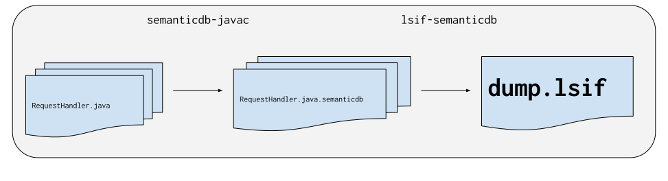

The `scip-java index` command does a best-effort to automatically index a given
codebase. The automatic step may not always work. The purpose of this page is to
document the steps to manually configure scip-java when automatic indexing
fails.

## Overview

Indexing a codebase consists of two independent phases:

- Compile the codebase with the SemanticDB compiler plugin.
- Generate SCIP index from SemanticDB files.



The first phase can be complicated to configure and it can take a while to run.
The second phase is quite simple to configure and it usually runs very fast.

## Step 1: Add SemanticDB compiler plugin to the classpath

The SemanticDB compiler plugin is published to Maven Central as a
zero-dependency Java library that you can install like any normal dependency.

[](https://repo1.maven.org/maven2/com/sourcegraph/semanticdb-javac/)

Use `curl` to download the compiler plugin jar file manually so that it can be
added to the `javac -classpath` option.

```sh
curl -Lo semanticdb-javac.jar https://repo1.maven.org/maven2/com/sourcegraph/semanticdb-javac/@STABLE_VERSION@/semanticdb-javac-@STABLE_VERSION@.jar
javac -classpath semanticdb-javac.jar MyApplication.java
```

If you're using Gradle.

```groovy
// Option 1: if you are not using annotation processors
compileOnly 'com.sourcegraph:semanticdb-javac:@STABLE_VERSION@'
// Option 2: if you are using annotation processors
annotationProcessor 'com.sourcegraph:semanticdb-javac:@STABLE_VERSION@'
```

If you're using Maven.

```xml
<dependency>
    <groupId>com.sourcegraph</groupId>
    <artifactId>semanticdb-javac</artifactId>
    <version>@STABLE_VERSION@</version>
</dependency>
```

If you're using sbt.

```scala
libraryDependencies += "com.sourcegraph" % "semanticdb-javac" % "@STABLE_VERSION@"
```

## Step 2: Enable `-Xplugin:semanticdb` compiler option

Add `-Xplugin:semanticdb` to your compiler options to enable the SemanticDB
compiler plugin. To do this you need to explicitly configure two directories:

- `-sourceroot:PATH`: the absolute path to the root directory of your codebase.
  It's important that all of the source files that should be index live under
  this directory.
- `-targetroot:PATH`: the absolute path to the directory where to generate
  SemanticDB file. This directory can be anywhere on your file system.  
  Alternatively, pass in `-targetroot:javac-classes-directory` for the plugin to
  automatically use the `javac` output directory.

If you're using Gradle.

```groovy
tasks.withType(JavaCompile) {
  def sourceroot = rootProject.projectDir
  def targetroot = new File(rootProject.buildDir, "semanticdb-targetroot")
  options.compilerArgs << "-Xplugin:semanticdb -sourceroot:$sourceroot -targetroot:$targetroot"
}
```

If you're using Maven.

```diff
 <project>
   [...]
   <build>
     [...]
     <plugins>
       <plugin>
         <groupId>org.apache.maven.plugins</groupId>
         <artifactId>maven-compiler-plugin</artifactId>
         <version>3.8.1</version>
         <configuration>
           <compilerArgs>
+            <arg>-Xplugin:semanticdb -sourceroot:${session.executionRootDirectory} -targetroot:${session.executionRootDirectory}/target/semanticdb-targetroot</arg>
           </compilerArgs>
         </configuration>
       </plugin>
     </plugins>
     [...]
   </build>
   [...]
 </project>
```

If you're using sbt.

```scala
javaHome := Some(...) // Must be configured to fork the compiler.
Compile / javacOptions += {
    val sourceroot = (ThisBuild / baseDirectory).value
    val targetroot = sourceroot / "target" / "semanticdb-targetroot"
    s"-Xplugin:semanticdb -sourceroot:$sourceroot -targetroot:$targetroot"
}
```

## Step 3: Compile the codebase

Compile all source files in the codebase once the compiler setting has been
configured. The exact command depends on your build tool. Below are some
examples:

- Gradle: `./gradlew clean compileJava compileTestJava`
- Maven: `mvn clean verify -DskipTests`
- sbt: `sbt clean test:compile`
- Bazel: `bazel build //...`

If everything went well, you should have a lot of `*.semanticdb` files in the
targetroot directory.

```
❯ find $TARGETROOT -type f
build/semanticdb-targetroot/META-INF/semanticdb/j8/src/test/java/example/ExampleTest.java.semanticdb
build/semanticdb-targetroot/META-INF/semanticdb/j8/src/main/java/example/Example.java.semanticdb
...
```

## Step 4: Generate SCIP index from SemanticDB files

First, install the `scip-java` command-line tool according to the instructions
in the [getting started guide](getting-started.md).

Next, run the `scip-java index-semanticdb` command to convert SemanticDB files
into SCIP.

```sh
❯ scip-java index-semanticdb $TARGETROOT
❯ file index.scip
index.scip: JSON data
```

## Step 5 (optional): Enable cross-repository navigation

By default, the `index.scip` file only enables navigation within the local
repository. You can optionally enable cross-repository navigation by creating
one of the following files in the SemanticDB _targetroot_ directory (the path in
`-Xplugin:semanticdb -targeroot:PATH`).

- `javacopts.txt`: line-separated list of Java compiler options that got passed
  to the compiler. For example,
  ```sh
  $ cat $TARGETROOT/javacopts.txt
  -Xlint
  -classpath
  -path/to/dependency1.jar:/path/to/dependency2.jar
  -d
  /path/to/classes/directory
  /path/to/com/example/Main.java
  ```
  The `javacopts.txt` file format can only be used if the jars on the dependency
  classpath have sibling `.pom` files. In some build tools like Gradle, the POM
  files are not siblings to the jars on the classpath so the `javacopts.txt`
  format cannot be used.
- `dependencies.txt`: a tab-separated values file where the columns are: group
  ID, artifact ID, version and jar path. For example,
  ```sh
  $ cat $TARGETROOT/dependencies.txt
  junit junit 4.13.2  /path/to/junit.jar
  org.hamcrest hamcrest-core 1.3  /path/to/hamcrest-core.jar
  ```
  The `dependencies.txt` format is used by scip-java to map symbols such as
  `org.junit.Assert` to Maven co-ordinates like `junit:junit:4.13.2`. As long as
  your Sourcegraph instance has another repository that defines that symbol, the
  cross-repository navigation should succeed. Only jar files are supported at
  the moment, classes directories are ignored.

Cross-repository navigation is a feature that allows "goto definition" and "find
references" to show results from multiple repositories.
